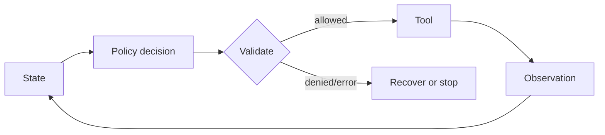

### Q: Explain ReAct’s reasoning-action-observation loop, state update, and termination.
* **Difficulty:** Senior
* **Category:** Architecture
* **The 10-Second Pitch:** ReAct alternates task reasoning, action/tool selection, and observation, letting evidence from actions revise subsequent decisions. The loop must enforce a typed action space, validation, budgets, termination, and untrusted-observation handling outside the model.
* **The Deep Dive:** State contains goal, policy, previous tool results, and progress. The model chooses a tool call or final response; the executor validates arguments and records the result; the next step conditions on that observation. Tool outputs can contain malformed data, secrets, or prompt injection, so they are quoted data—not authority.

  ```text
  state → policy/model → validated action → tool sandbox → observation → state
                  ↑                         budget / approval / policy gates
                  └──────── final answer or bounded termination ────────────┘
  ```
ReAct alternates a private decision state with a typed action and an externally supplied observation. The orchestrator—not model prose—parses the action, validates authority, executes once, and appends a bounded observation. Termination is an explicit transition on success, infeasibility, approval denial, or budget exhaustion.

Untrusted observations never become higher-priority instructions.

* **Production Reality & Tradeoffs:** Explicit structured state and tool calls are easier to replay than hidden free-form traces. Do not permit unrestricted shell, browser, or financial actions merely because the model generated syntactically valid arguments.
* **Red Flag:** Giving a ReAct prompt direct production credentials and calling it guardrailed.
