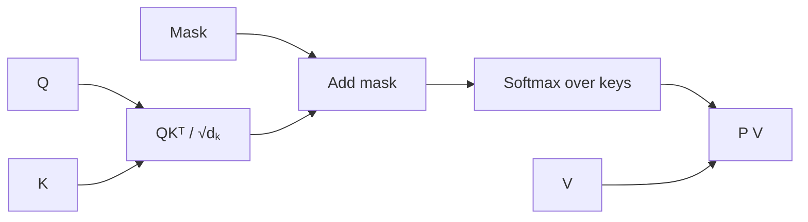

### Q: Derive scaled dot-product attention and explain the $1/\sqrt{d_k}$ factor.
* **Difficulty:** Mid
* **Category:** Math
* **The 10-Second Pitch:** Attention scores query–key compatibility, scales by $\sqrt{d_k}$ to keep logit variance stable, masks invalid keys, normalizes over keys, and returns a weighted sum of values: $\operatorname{softmax}(QK^T/\sqrt{d_k}+M)V$.
* **The Deep Dive:** For one head, $Q\in\mathbb R^{T_q\times d_k}$, $K\in\mathbb R^{T_k\times d_k}$, and $V\in\mathbb R^{T_k\times d_v}$. Scores $S=QK^T/\sqrt{d_k}$ have shape $[T_q,T_k]$; row $i$ compares query $i$ to every key. Add mask $M$ with $0$ for allowed and $-\infty$ for forbidden positions, compute row-softmax $P$, then $O=PV\in\mathbb R^{T_q\times d_v}$.

If independent Q/K components have mean zero and variance one, $q^Tk=\sum_{j=1}^{d_k}q_jk_j$ has variance approximately $d_k$. Without scaling, larger heads produce logits of magnitude $O(\sqrt{d_k})$, saturating softmax and yielding concentrated, poorly conditioned gradients. Dividing by $\sqrt{d_k}$ keeps variance near one. Learned projection/normalization violate exact assumptions, but the scale remains effective.

Stable softmax subtracts each row maximum; fully masked rows need explicit zero/sentinel handling.
* **Production Reality & Tradeoffs:** Dense score materialization costs $O(T_qT_k)$ memory; FlashAttention tiles the same exact computation. Wrong mask dtype/finite sentinel can leak. Low precision and long rows require FP32-like accumulations. Attention weights are not faithful explanations by default.
* **Red Flag:** Normalizing over queries, applying the mask after softmax, or explaining scaling only as preventing numeric overflow rather than variance/saturation.

