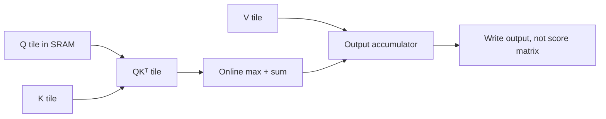

### Q: Explain FlashAttention’s tiling, online softmax, recomputation, and IO complexity.
* **Difficulty:** Principal
* **Category:** Systems
* **The 10-Second Pitch:** FlashAttention computes exact softmax attention in SRAM-sized Q/K/V tiles, maintaining online row maxima and normalizers so it never writes the $T\times T$ score/probability matrices to HBM. It trades recomputation for far less memory traffic.
* **The Deep Dive:** Naive attention materializes $S=QK^T$ and $P=\operatorname{softmax}(S)$ in HBM, creating $O(T^2)$ intermediate storage/traffic. FlashAttention loads a Q block and streams K/V blocks through on-chip memory. For each query row it maintains maximum $m$, normalizer $\ell$, and output accumulator $o$. When a new block has maximum $m_b$, update $m'=\max(m,m_b)$, rescale old/new exponentials by $e^{m-m'}$ and $e^{m_b-m'}$, update $\ell$, and combine value sums. This is algebraically the same stable softmax, not sparse/approximate attention.

Backward recomputes score/probability tiles from Q/K and saved row statistics rather than storing them. Causal/block masks are applied tile-wise. The IO complexity: for sequence length $T$, head dimension $d$, and SRAM size $M$,

$$
\underbrace{\Theta(Td+T^2)}_{\text{standard attention}}
\quad\text{vs.}\quad
\underbrace{\Theta\!\left(T^2d^2/M\right)}_{\text{FlashAttention}}
\ \text{HBM accesses},
$$

so whenever $M\gg d^2$—true for typical $d\le 128$ on ~100 KB-class SRAM—FlashAttention performs roughly $M/d^2$ times fewer HBM accesses, which is where the wall-clock gain comes from: arithmetic remains dense $O(T^2d)$, but the memory traffic that actually bounds attention on modern GPUs shrinks by orders of magnitude, enabling longer contexts.
* **Production Reality & Tradeoffs:** Speed depends on shape, dtype, mask, head dimension, hardware, and occupancy; short/odd cases may not win. Dropout RNG must be reproducible under recomputation. Flash decoding/paged attention solve related but different decode/cache problems.
* **Red Flag:** Calling FlashAttention an approximation that changes attention values, or saying it reduces dense attention FLOPs to linear.

