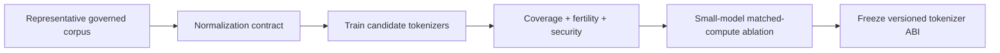

### Q: Design and evaluate a tokenizer for multilingual prose, code, math, and structured data.
* **Difficulty:** Principal
* **Category:** System Design
* **The 10-Second Pitch:** Define a reversible byte-complete normalization and special-token contract, train on a governed balanced mixture, and evaluate fertility, coverage, round-trip, boundary stability, downstream quality, security, and end-to-end compute—not compression alone.
* **The Deep Dive:** Inventory languages/scripts, code languages, math/LaTeX, JSON/XML/tables, numbers, whitespace, and control needs. Snapshot/weight a representative corpus so high-volume English does not consume the vocabulary. Choose Unicode policy and byte fallback, pre-tokenization that preserves code/whitespace, BPE or Unigram objective, vocabulary budget, deterministic tie rules, and reserved versioned special tokens. Never let ordinary input synthesize control tokens.

Evaluation includes byte-exact round trip; no unknowns; tokens per byte/character/word by language/domain; distribution and p99 fertility; word/morpheme boundary quality; numbers/operators/identifiers; perturbation stability for whitespace/normalization; special-token injection/confusables; training throughput; embedding/output projection cost; and downstream loss/tasks at matched compute. Compare vocabulary sizes on full model budget: shorter sequences reduce attention/KV but larger $V$ raises embeddings/logits.

* **Production Reality & Tradeoffs:** A tokenizer is effectively immutable after pretraining; migration requires embedding/output remapping or retraining and invalidates caches. Publish per-language impact and test low-resource scripts with native reviewers.
* **Red Flag:** Choosing the tokenizer with the best aggregate compression while ignoring language tails, code, security, and model-quality ablations.

