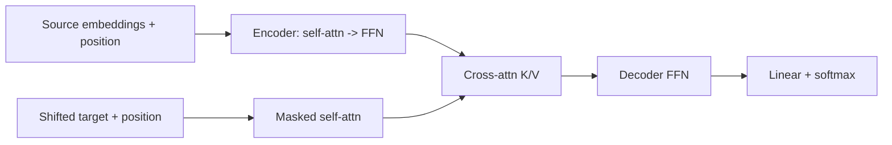

### Q: Explain the original encoder block, decoder block, masked self-attention, and encoder-decoder cross-attention.
* **Difficulty:** Senior
* **Category:** Architecture
* **The 10-Second Pitch:** The original Transformer stacks post-norm encoder blocks of bidirectional self-attention plus FFN, and decoder blocks of masked self-attention, encoder-decoder cross-attention, and FFN, each wrapped by residual addition and LayerNorm.
* **The Deep Dive:** Source tokens receive embeddings plus sinusoidal positions. Each encoder layer computes multi-head self-attention over all valid source positions, then a position-wise FFN $\max(0,xW_1+b_1)W_2+b_2$. In the 2017 architecture, each sublayer is `LayerNorm(x + Dropout(Sublayer(x)))`—post-norm.

Decoder target inputs are shifted right. Masked self-attention uses a triangular mask so position $t$ cannot see future target labels. Cross-attention then uses decoder states as Q and final encoder outputs as K/V; this lets every target position retrieve source content without changing source memory. A third FFN follows. Output hidden states project to vocabulary softmax, with embedding/softmax weights shared in the paper.

Multi-head attention performs projection, scaled scores, softmax, value mix, concat, and output projection; residual/dropout/norm occur outside that core.
* **Production Reality & Tradeoffs:** Modern LLMs often use pre-norm, RMSNorm, SwiGLU, RoPE, GQA, and decoder-only stacks, so distinguish original paper from current variants. Training is target-parallel; generation remains sequential with KV caches.
* **Red Flag:** Forgetting the target shift/mask, or saying cross-attention uses encoder queries and decoder keys.

