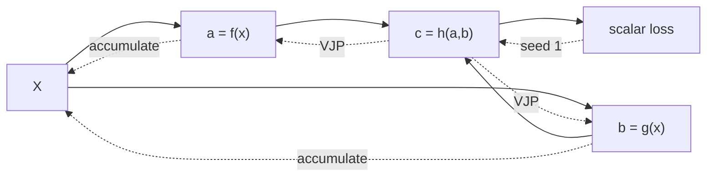

### Q: Derive backpropagation through an arbitrary computation graph using vector-Jacobian products.
* **Difficulty:** Senior
* **Category:** Math
* **The 10-Second Pitch:** Backpropagation is reverse-mode AD: topologically execute and cache the graph, seed the scalar loss adjoint with one, then traverse in reverse and accumulate vector-Jacobian products from every consumer into each parent.
* **The Deep Dive:** Let node $v$ compute $y_v=f_v(x_1,\ldots,x_k)$ and define its adjoint $\bar y_v=\partial L/\partial y_v$. For parent $x_i$, the contribution is

$$
\bar x_i \mathrel{+}= \bar y_v\,\frac{\partial y_v}{\partial x_i},
$$

which is a vector-Jacobian product (VJP). The `+=` is essential when a value fans out: the multivariable chain rule sums every downstream path. Reverse mode never materializes the full Jacobian; each primitive supplies a local VJP.

For $a=x^2$, $b=\sin x$, and $L=ab$, reverse traversal gives $\bar a=b$, $\bar b=a$, then $\bar x=\bar a(2x)+\bar b\cos x$. Checkpointing discards selected activations and recomputes them backward, trading compute for memory. Detach/stop-gradient deletes paths; in-place mutation can invalidate cached values.
* **Production Reality & Tradeoffs:** For one scalar loss and millions of parameters, reverse mode costs roughly a small multiple of forward compute but stores activations. Distributed/autograd systems must handle shared parameters, gradient accumulation, mixed precision, recomputation RNG, custom VJPs, and collective ordering. Use JVPs for few-input/many-output problems.
* **Red Flag:** Multiplying full Jacobian matrices, overwriting rather than accumulating gradients at fan-out, or claiming backprop is a numerical finite-difference method.

