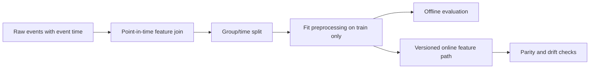

### Q: Diagnose leakage, temporal leakage, entity leakage, duplicate leakage, and train-serving skew.
* **Difficulty:** Senior
* **Category:** Debugging
* **The 10-Second Pitch:** Leakage makes offline evaluation unrealistically optimistic because unavailable or related information crosses the split; train-serving skew changes feature computation after deployment. Diagnose through lineage, point-in-time joins, group/time splits, duplicate analysis, and offline-online feature parity.
* **The Deep Dive:** Draw the prediction timestamp and ask whether every feature existed then. Target leakage directly includes the outcome or a post-outcome proxy. Temporal leakage uses future records in features, labels, normalization, or cross-validation. Entity leakage puts the same user/device/document/template in train and test, allowing memorization. Duplicate leakage includes exact, near, augmented, translated, or chunk-level variants across splits. Preprocessing leakage fits imputers, vocabularies, PCA, or feature selection on all data.

Run temporal backtests and group-aware splits, deduplicate before splitting, and use “impossible” baselines: suspiciously high performance from identifiers or post-event fields is evidence. For skew, log feature name/version/value online, recompute the same examples offline, and compare missingness, units, categorical maps, windows, time zones, and defaults. Underfitting gives poor train and validation performance; ordinary overfitting gives a train-validation gap without requiring leakage.
* **Production Reality & Tradeoffs:** Strict time/entity splits usually lower scores but predict deployment better. Leakage can occur through pretrained embeddings, retrieval corpora, human labels, or benchmark contamination, not only tables. Feature stores reduce skew only if definitions and event-time semantics are shared.
* **Red Flag:** Randomly splitting temporal/user data and calling a high validation score proof there is no leakage.

