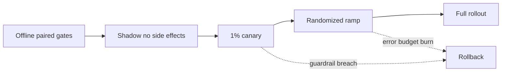

### Q: Design a statistically valid offline/online experiment and stopping rule for a model launch.
* **Difficulty:** Principal
* **Category:** Experimentation
* **The 10-Second Pitch:** Predefine population, randomization unit, primary effect, minimum useful change, guardrails, power, multiplicity, and valid stopping; use offline paired evidence to de-risk, then sticky online randomization with staged rollout and rollback.
* **The Deep Dive:** Offline, freeze a representative replay/golden/adversarial set, compare old/new per item, and bootstrap clusters such as users/documents. Report effect intervals and severe-error counts, not only means. For online testing define eligibility, user/account randomization to prevent memory/interference, sticky assignment, intent-to-treat, primary metric, safety/latency/cost guardrails, minimum detectable effect, alpha/power, duration for weekly cycles and delayed labels, and exclusion/missingness rules before launch.

Fixed-horizon analysis forbids optional peeking. If continuous monitoring/stopping is required, use group-sequential boundaries, alpha spending, confidence sequences, or a prespecified Bayesian decision rule. Correct multiple confirmatory metrics; exploratory slices need shrinkage/FDR and confirmation. Estimate heterogeneous effects only with adequate support.
* **Production Reality & Tradeoffs:** Novelty, interference, seasonality, selective feedback, and concurrent launches invalidate simple IID analysis. Rare safety harms may require simulation/red teaming rather than feasible online power. Statistical significance does not override practical/safety thresholds.
* **Red Flag:** Stopping when $p<0.05$, randomizing individual messages for a stateful assistant, or testing without a rollback owner.

