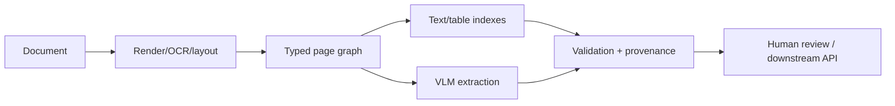

### Q: Design a multimodal document-intelligence platform with OCR, layout, tables, VLMs, and review.
* **Difficulty:** Principal
* **Category:** System Design
* **The 10-Second Pitch:** Ingest immutable documents, classify pages, run OCR/layout/table extraction, route uncertain regions to VLMs, normalize into a provenance-rich schema, validate, and send high-risk/low-confidence fields to human review.
* **The Deep Dive:** Pipeline preserves file hash, page coordinates, reading order, language, and versions. OCR produces tokens/confidence; layout detects blocks; table model reconstructs cells/headers; deterministic parsers handle barcodes/forms where possible. VLM resolves ambiguous visual relations using cropped regions plus context. Field output stores raw/normalized value, source box/span, model, confidence, and validation status. Review UI shows evidence and corrections feeding evaluation/training with governance.
* **Production Reality & Tradeoffs:** Scanned quality, handwritten text, tables, and adversarial PDFs drive errors. Async processing, GPU routing, and page caching control cost. ACLs and PII apply to every derivative.
A robust document platform preserves the original asset, page render, OCR tokens with coordinates/confidence, layout blocks, tables/cells, reading order, and versioned provenance.

Use deterministic parsers for totals/dates where possible, VLMs for ambiguous layout, and confidence/risk routing for review.

* **Red Flag:** Sending the entire PDF to one VLM and trusting its JSON.
