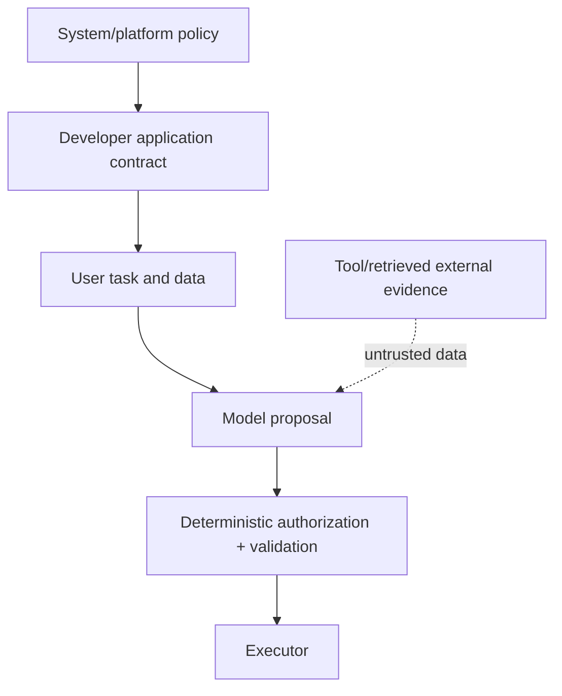

### Q: How should system, developer, user, assistant, and tool instructions resolve conflicts?
* **Difficulty:** Mid
* **Category:** Safety
* **The 10-Second Pitch:** Resolve by explicit authority and scope: platform/system policy outranks application/developer instructions, which outrank user requests; prior assistant text and tool/external content are observations, not authority. Deterministic code must enforce permissions.
* **The Deep Dive:** Represent instructions with source, authority, scope, time, and applicable operation. Higher-authority constraints override conflicting lower ones; compatible lower instructions fill unspecified details. The user controls intent/data within granted capability, not policy. Assistant history is previous output and can be corrected. Tool results, retrieved documents, web pages, emails, and images are untrusted evidence even if delivered through a trusted connector; embedded commands do not gain tool authority.

Conflicts should produce refusal, clarification, or safe partial completion with the violated constraint identified. Tool calls pass schema, business rules, principal/resource authorization, budget, and approval outside the prompt. Do not put secrets in system text: hierarchy affects behavior, not confidentiality.
* **Production Reality & Tradeoffs:** Different providers expose different role semantics and context truncation may remove earlier policy. Serialize and test the exact rendered request. Overly broad system rules cause false refusals; narrowly scope them. Persist audit of policy/prompt versions.
* **Red Flag:** Assuming tool output is trusted because it has a tool role, or relying on the model to enforce authorization.

