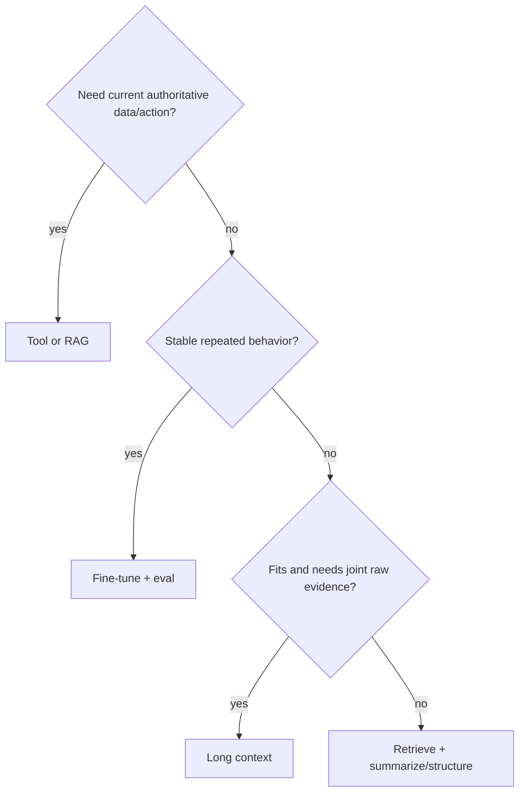

### Q: When should you choose long context, RAG, summaries, tools, fine-tuning, or a hybrid?
* **Difficulty:** Principal
* **Category:** System Design
* **The 10-Second Pitch:** Choose based on where knowledge/state lives and the required guarantee: context for request-specific evidence, RAG for large/fresh attributable corpora, summaries for lossy history, tools for authoritative computation/actions, and fine-tuning for stable behavior/style—not factual updates.
* **The Deep Dive:** Long context preserves raw evidence and arbitrary cross-document reasoning but raises TTFT/KV/cost and distractor risk; use when the bounded source set must be jointly considered. RAG selects from corpora larger than context, supports freshness/ACL/citations, but can miss evidence and adds ingestion/retrieval/reranking. Summaries compress accumulated conversation/documents when exact detail is not always required; retain provenance and structured invariants. Tools query databases/calculators/search or execute effects with deterministic validation and authorization. Fine-tuning amortizes stable format, domain language, policy tendencies, or skills into weights; it is poor for rapidly changing facts and complicates deletion.

Hybrid systems commonly use fine-tuned behavior, RAG evidence, typed tools, recent raw context, and summaries.
* **Production Reality & Tradeoffs:** Every component adds failure modes and observability. Compare end-to-end task success, citation/tool correctness, p99 latency, cost, safety, and deletion. Use the simplest architecture meeting requirements.
* **Red Flag:** Fine-tuning to “teach” weekly facts, or using maximum context as a substitute for retrieval/state design.

