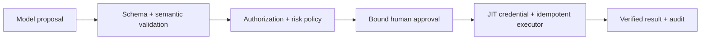

### Q: Design a prompt-plus-policy pipeline for side-effecting tool use and human approval.
* **Difficulty:** Principal
* **Category:** System Design
* **The 10-Second Pitch:** The prompt may propose a typed action; deterministic policy authenticates and authorizes it, canonicalizes arguments, risk-scores it, binds approval to an immutable digest, then executes once with a scoped credential and audit.
* **The Deep Dive:** Context gives the model user intent, untrusted evidence, narrow tool descriptions, and explicit rule that it cannot claim execution. Output is either answer/clarification or proposal `{tool, args, evidence, rationale}`. A policy enforcement point parses schema, canonicalizes units/IDs, checks current principal/resource authorization, business invariants, egress, rate/cost, and action risk. High-risk actions render an exact preview/diff; approval signs digest of principal, tool/version, canonical args, resource version, and expiry. Any change invalidates approval. Executor exchanges workload identity for a JIT capability, uses idempotency key and prepare/commit, verifies result, and records audit.

Failures return typed errors; retries remain within deadline and cannot duplicate effects. Kill switch/revocation bypasses model.
* **Production Reality & Tradeoffs:** Approval adds latency and fatigue; tier by reversibility/blast radius. Model explanation may mislead reviewer, so preview authoritative data. Policy outage fails closed for effects but may allow read-only mode.
* **Red Flag:** Giving the model broad credentials and asking it to seek confirmation in natural language before acting.

