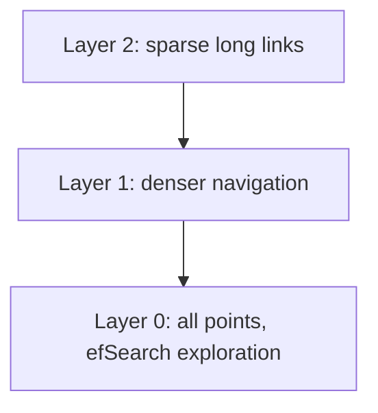

### Q: Explain HNSW insertion, multilayer traversal, M, efConstruction, efSearch, and deletion behavior.
* **Difficulty:** Principal
* **Category:** Systems
* **The 10-Second Pitch:** HNSW builds a probabilistic multilayer proximity graph: upper sparse layers greedily navigate globally, then a bounded best-first search explores the dense base. $M$ controls degree/memory, construction/search `ef` controls candidate breadth and recall/latency.
* **The Deep Dive:** Each inserted vector samples a maximum level from an exponentially decaying distribution. Starting at the current top entry point, insertion greedily descends to closer nodes; at each relevant layer it performs an `efConstruction` search, selects diverse neighbors, adds bidirectional edges, and prunes degree around $M$ (base may differ). Search greedily descends upper layers with `ef=1`, then at level zero maintains candidate and best-result heaps up to `efSearch`, expanding while candidates can improve the current worst result.

Larger $M$ improves connectivity/recall but raises index memory/build/search distance computations. Higher `efConstruction` improves graph quality at build cost; higher `efSearch` raises query recall/latency and must be at least result $k$. Deletions are commonly tombstones/lazy and can degrade connectivity/memory until compaction/rebuild; updates are delete+insert. Filters can leave traversed neighbors unusable.
* **Production Reality & Tradeoffs:** HNSW is memory-heavy and mutable concurrency/replication are operational concerns. Measure recall against exact search by query/filter slice and p99 latency, not one synthetic dataset. Quantization changes distance/order. Backup/rebuild/version migrations need capacity.
* **Red Flag:** Describing HNSW as clustering, or claiming `efSearch=k` guarantees exact top-k.

