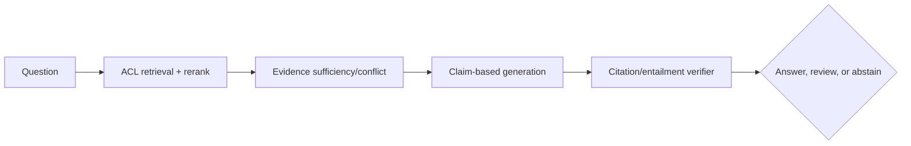

### Q: Design evidence sufficiency, conflicting-source handling, and calibrated abstention.
* **Difficulty:** Principal
* **Category:** System Design
* **The 10-Second Pitch:** Retrieve authoritative provenance-rich evidence, assess whether every material claim has sufficient current support, preserve conflicts, generate claim-linked citations, and answer/review/abstain through calibrated risk policy rather than model confidence.
* **The Deep Dive:** Define source authority, freshness, jurisdiction, and required support per task. Retrieval must return exact spans with document/version/time/ACL. A sufficiency stage identifies requested atomic claims and checks coverage; multi-hop answers require all premises. Conflicts are not averaged: list alternatives with source authority/effective date and apply only explicit precedence policy. The generator is constrained to supplied evidence, emits claim-to-span citations and `supported/conflicting/insufficient` status. A verifier checks entailment, citation completeness/correctness, numerical consistency, and unsupported claims.

Abstention policy combines verifier results, retrieval coverage, source quality/freshness, task severity, and calibrated validation data. Ask clarification when one missing input is resolvable; otherwise state what evidence is absent.
* **Production Reality & Tradeoffs:** Verification models can share generator blind spots; sample expert audits. Strict grounding over-abstains when corpus incomplete; loose grounding invents. More evidence raises tokens/distractors. Never cite a whole document when only one span is needed.
* **Red Flag:** Treating top-k retrieval as sufficient evidence or accepting any citation marker as grounding.

