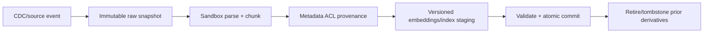

### Q: Design idempotent ingestion with provenance, versions, ACL inheritance, deletion, and freshness SLAs.
* **Difficulty:** Principal
* **Category:** System Design
* **The 10-Second Pitch:** Use source/version/content identity and an event-driven state machine from sandboxed parsing through chunks/embeddings/index commit; preserve provenance and ACL on every derivative, publish atomically, and make deletion/tombstones verifiable under an SLA.
* **The Deep Dive:** Connector authenticates source and emits event `{tenant, source_id, source_version, content_hash, ACL_version, event_time}` with idempotency key. Store immutable raw snapshot; sandbox parse/OCR, build layout/structure, classify/redact, chunk with stable IDs and parent/span coordinates, then batch embed using pinned model. Write new version to staging index, validate counts/checksums/ACL/sample queries, atomically move an alias/manifest, and only then retire old version. Out-of-order events compare source versions.

ACL inheritance records source rule and resolved policy/version; query enforces before returning content. Deletion writes a tombstone, blocks reads immediately, purges chunks/vectors/caches/summaries/backups per retention, and runs reconciliation. Monitor source-to-search freshness and failed/dead-letter events.
* **Production Reality & Tradeoffs:** Exactly-once is built from idempotency and atomic visibility, not broker promises. Re-embedding/rechunking doubles temporary storage. Shared indexes complicate ACL/deletion; per-tenant costs more. Preserve audit without retaining deleted payload.
* **Red Flag:** Overwriting documents in place or deleting only vectors while cached chunks and summaries remain.

