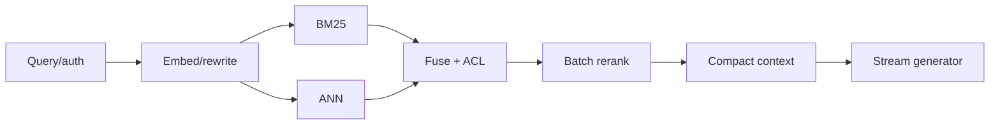

### Q: Design a million-document RAG service under a 500 ms p95 budget.
* **Difficulty:** Principal
* **Category:** System Design
* **The 10-Second Pitch:** Budget every stage and parallelize independent work: cached query processing, hybrid ANN/lexical retrieval, selective batched reranking, compact context, a fast routed generator or streamed TTFT, and deadline-aware degradation with observability.
* **The Deep Dive:** First clarify whether 500 ms means TTFT or complete answer; full LLM completion may be infeasible. Example TTFT budget: gateway/auth 15 ms, rewrite/embed 35, parallel BM25+ANN 30, ACL/filter/fusion 15, cross-encoder top-50 60, context assembly 15, network/queue 50, model prefill/first token 200, margin 80. Co-locate indexes/reranker/model, warm pools, batch embeddings/reranker, use HNSW/quantized vectors tuned to recall, cache safe query embeddings/prefixes, and retrieve small then expand parents.

Propagate a deadline; if reranker is slow, use fused candidates; if retrieval fails, return explicit unavailable/async—not hallucinated fallback. Admission/backpressure isolate long queries. Trace p50/p95/p99 queue and service by stage and cache/filter distributions.
* **Production Reality & Tradeoffs:** Lower `efSearch`, candidate count, or model size trades recall/quality. More replicas reduce queues but cost. Benchmark joint production lengths/filters and failure bursts; averages do not meet p95.
* **Red Flag:** Assigning 500 ms entirely to the model or removing authorization/reranking without measuring quality/safety.

