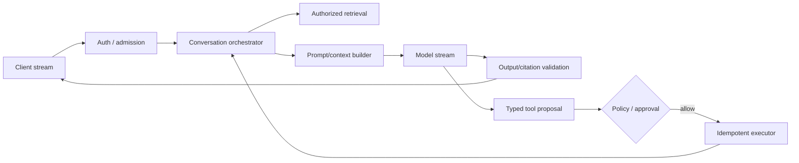

### Q: Design a streaming chat assistant with memory, RAG, tools, safety, observability, and citations.
* **Difficulty:** Principal
* **Category:** System Design
* **The 10-Second Pitch:** Use an authenticated streaming orchestrator with bounded conversation state, ACL-first retrieval, provenance-rich context, typed tool proposals behind policy, incremental safety, and end-to-end versioned traces.
* **The Deep Dive:** Gateway authenticates tenant/user, rate-limits tokens, assigns request/turn IDs, and supports cancellation. Context service compacts recent turns and retrieves explicit user-approved memory with provenance and deletion. RAG rewrites the query, applies ACL filters before ANN, reranks, deduplicates, and packs cited spans under a budget. The model streams answer events or typed tool proposals; a policy enforcement point independently validates schema, authorization, risk, egress, and bound approval. Tool results re-enter as untrusted data. Incremental output moderation buffers only where necessary and citations map claims to source spans. Persist durable turn state after commit; prompt/KV/semantic caches are tenant/model/version scoped.

```text
client <-> gateway -> context + ACL retrieval -> model stream -> cited response
                         |                         |
                    memory policy             tool proposal
                                                   |
                                  auth + validation + approval -> executor
```

Trace latency, token/KV use, retrieval IDs, model/prompt/policy/tool versions, decisions, and outcomes without logging secrets.
* **Production Reality & Tradeoffs:** Memory and tools increase utility and blast radius. Streaming complicates rollback/moderation; citations add context. Degrade to read-only/abstention when retrieval or policy fails, and cap context/output/tool loops.

The control path to tools is separate from the token stream: emitting text never performs an effect.

* **Red Flag:** Sending the whole chat plus top-k documents to a model with broad tools and filtering only final text.
