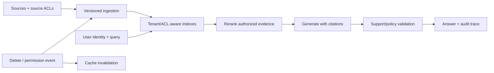

### Q: Design a multi-tenant enterprise knowledge assistant with ACLs, versions, deletion, and audit.
* **Difficulty:** Principal
* **Category:** System Design
* **The 10-Second Pitch:** Enforce tenant and document authorization before retrieval, version every source and derivative, propagate deletion through indexes/caches/memory, and produce an auditable claim-to-source trace.
* **The Deep Dive:** Ingestion authenticates connectors, snapshots source/version/ACL, parses and chunks with provenance, scans content, embeds with versioned model, and writes a tenant/region-scoped index. Query authorization creates a principal filter applied before approximate search or via cryptographically/physically isolated indexes; post-filter-only designs leak and hurt recall. Reranking and context preserve document/version/span. Answers cite evidence and disclose conflicts/freshness. Change-data capture invalidates or tombstones derived chunks, embeddings, caches, summaries, and memories; deletion has an SLO, verification scan, and immutable audit without retaining deleted payload. Control plane versions connectors, parser, chunker, embeddings, index, prompt, model, and policy and supports shadow backfills.
* **Production Reality & Tradeoffs:** Per-tenant indexes isolate strongly but waste capacity; shared filtered indexes are efficient but risk ACL bugs. Eventual deletion and source ACL lag must be explicit. Audit records need privacy retention and access control.

Authorization happens at every data access and remains attached to derived chunks, summaries, and caches.

* **Red Flag:** Applying permissions after vector search or deleting only the source row while embeddings and caches remain.
