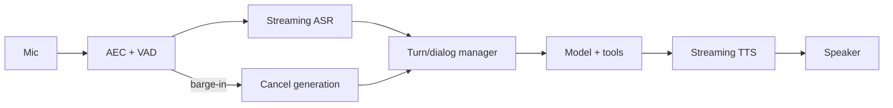

### Q: Design a real-time voice assistant with streaming ASR, dialogue, tools, TTS, and barge-in.
* **Difficulty:** Principal
* **Category:** System Design
* **The 10-Second Pitch:** Use timestamped full-duplex audio, AEC/VAD/streaming ASR, a cancellable dialogue/tool state machine, incremental TTS, and generation IDs that prevent interrupted turns from committing stale actions.
* **The Deep Dive:** Client/edge performs acoustic echo cancellation, noise handling, VAD, timestamps, and encrypted streaming. ASR emits revisable partials and final segments with word times; endpointing balances responsiveness and truncation. Dialogue consumes committed text plus bounded context and can start speculative reasoning, but high-impact tools wait for stable intent and independent policy. TTS streams chunks with prosody and watermarking/consent controls. Barge-in immediately stops playback, cancels decode, increments turn generation, and invalidates uncommitted tool proposals; already committed effects remain visible and compensatable. Ordered event IDs reconcile network reordering/reconnect. Safety runs on acoustic/transcript input, tool proposal, and output. Metrics split speech-end-to-first-audio, WER, endpoint delay, interruption stop, tool success, and echo reentry.
* **Production Reality & Tradeoffs:** Aggressive endpointing lowers latency but cuts users; speculative tools save time but create races. Cloud audio raises privacy/egress concerns; edge models cost battery. Degrade to push-to-talk/text when full duplex fails.

Barge-in cancels speculative speech immediately, but transactional tool operations require status reconciliation rather than blind cancellation.

* **Red Flag:** Connecting ASR text to chat and TTS without echo cancellation, partial-revision semantics, or stale-action cancellation.
