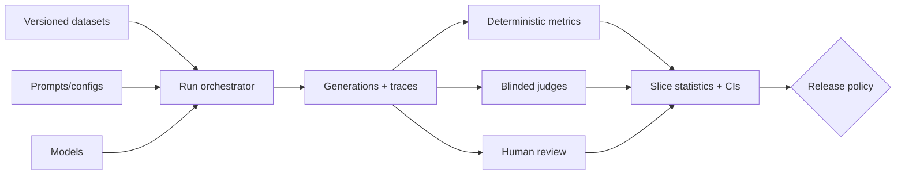

### Q: Design an evaluation platform for datasets, prompts, models, judges, humans, experiments, and gates.
* **Difficulty:** Principal
* **Category:** Platform Architecture
* **The 10-Second Pitch:** Use immutable versioned manifests, isolated idempotent execution, content-addressed artifacts, deterministic reducers, human workflow, paired comparison with uncertainty, and governed release gates.
* **The Deep Dive:** Registry stores datasets with provenance/splits/access, system bundles containing model/prompt/retrieval/tools/policy, judge/rubric versions, and metric code. A run manifest pins all identifiers, seeds, environment, and sampling. Scheduler shards cases; workers execute in sandboxes/provider adapters, capture structured outputs/traces/cost/latency, and retry idempotently. Reducers compute task and slice metrics with bootstrap intervals and judge-bias diagnostics. Human labeling service supports qualification, blind assignment, ties, evidence, adjudication, and audit. Comparison service produces paired deltas, drill-down, and artifact diffs. Gates combine severe invariant failures, capability nonregression, SLO/cost constraints, waiver owner/expiry, and signed decision records. RBAC, redaction, residency, and retention protect test data.
* **Production Reality & Tradeoffs:** Reproducibility is statistical for mutable APIs. Storing raw traces is expensive and sensitive. Platform flexibility can enable metric shopping; templates and governance should preserve comparability without blocking exploration.

Every result binds dataset, model, prompt, decoding, tool, and evaluator versions.

* **Red Flag:** An evaluation dashboard that stores aggregate scores but cannot reconstruct the exact system, inputs, or judge.
