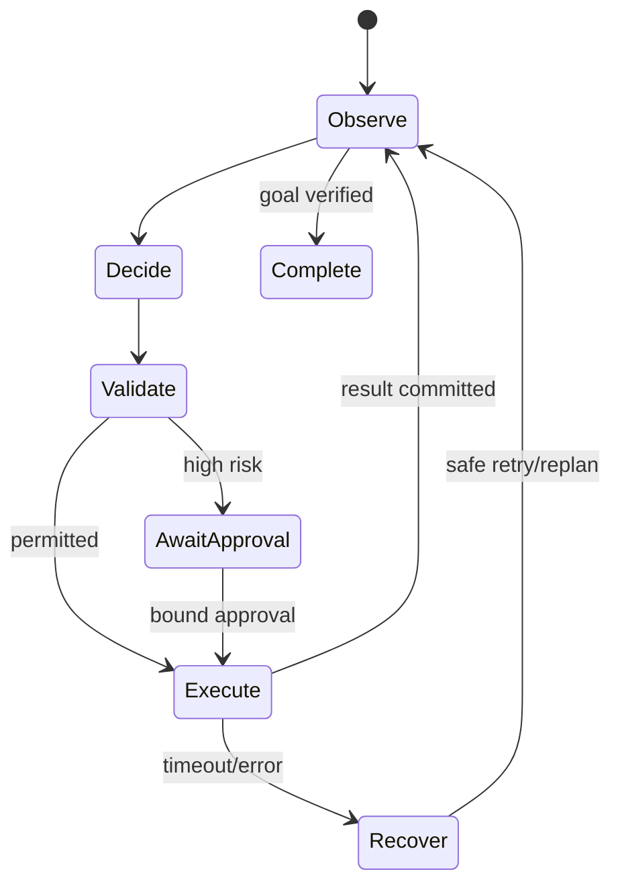

### Q: Design an agent platform with tools, policy, durable state, memory, tracing, simulation, and approval.
* **Difficulty:** Principal
* **Category:** Agent Platform
* **The 10-Second Pitch:** Separate probabilistic planning from deterministic authority: typed versioned tools, policy enforcement, event-sourced durable runs, provenance/ACL memory, full traces, sandbox simulation, and approvals bound to exact actions.
* **The Deep Dive:** Agent runtime is a state machine over observations, model proposals, policy decisions, tool calls, results, checkpoints, and terminal status. Event log and snapshots support pause/resume, retry, cancellation, and replay; every event has run/turn/generation ID. Tool registry versions schemas, scopes, side-effect class, idempotency, timeout, and compensation. Policy enforcement authenticates principal, validates arguments/resources, limits budgets/egress, and requests approval whose digest binds action, state version, and expiry. Secrets broker issues JIT capabilities to executor. Memory distinguishes working, episodic, and user/org knowledge with ACL, provenance, retention, and deletion. Trace records versions/tokens/cost/latency without secrets. Simulator mirrors tool schemas and injects adversarial content/failures before canary.
* **Production Reality & Tradeoffs:** Durability and approvals add latency; memory creates privacy and poisoning risk. Tool evolution needs compatibility. Cap steps/tokens/cost and provide kill switches. Multi-agent messaging is another untrusted tool boundary.

Durability comes from versioned state and idempotent effect records, not from the graph drawing itself.

* **Red Flag:** Giving an agent a loop, shared vector memory, and broad API keys and calling that a platform.
