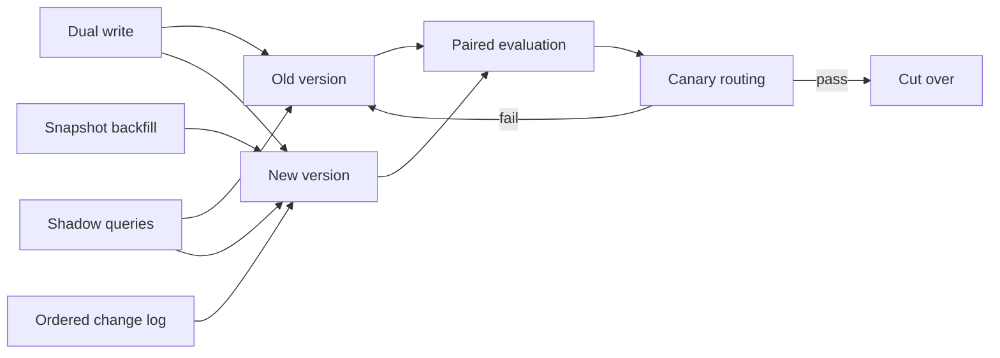

### Q: Migrate model providers, prompts, tokenizers, embeddings, indexes, schemas, and adapters without downtime.
* **Difficulty:** Principal
* **Category:** Migration
* **The 10-Second Pitch:** Version the entire AI bundle, establish compatibility contracts, replay/shadow the new path, dual-write and backfill stateful artifacts, canary reads, and preserve an independently usable rollback until reconciliation completes.
* **The Deep Dive:** Inventory coupled artifacts: provider API/tool/stream semantics, model and safety behavior, prompt/chat template, tokenizer IDs and length, embedding space/dimension/metric, index/chunks, schemas, adapters/base digest, caches, and observability. Define translators and compatibility matrix. Stateless model/prompt changes use offline replay, shadow traffic, then slice-aware canary. Embedding/index changes require new namespace, snapshot backfill, CDC/dual-write, coverage reconciliation, shadow query comparison, gradual read shift, and old-index rollback. Schema changes use expand-migrate-contract; readers tolerate both versions. Tokenizer changes invalidate token/KV/prefix caches and length budgets. Adapters must be retrained or proven compatible with exact base. Versioned routing enables cohort rollback and prevents mixed cache/state.
* **Production Reality & Tradeoffs:** Dual systems double temporary cost and writes can diverge. Shadowing may expose data to a new provider, requiring approval. Rollback after new writes needs forward/backward schema support. Define point of no return explicitly.

Retire the old path only after parity, deletion reconciliation, client migration, and rollback expiry.

* **Red Flag:** Changing an endpoint alias in place and discovering afterward that tokenizer, tools, embeddings, or adapters are incompatible.
